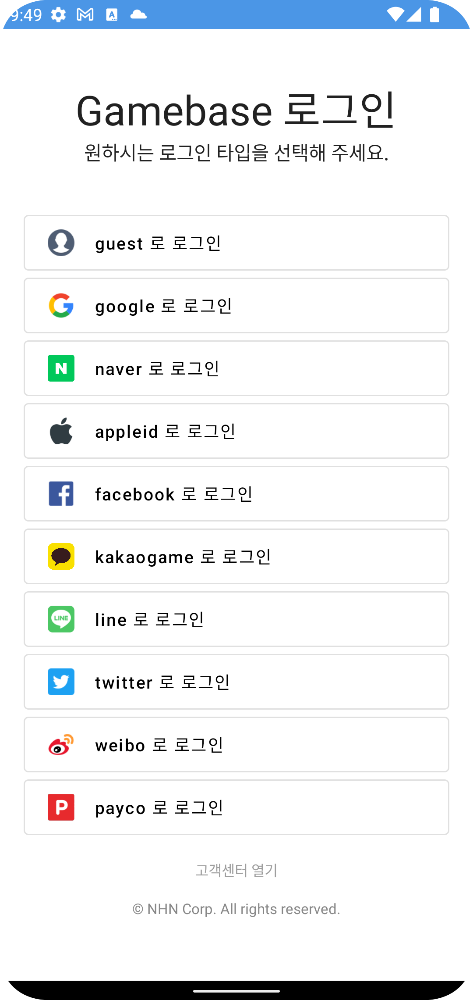
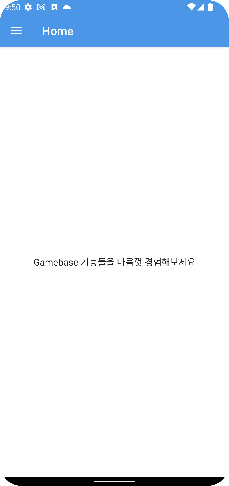
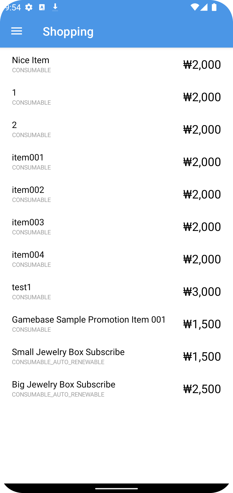
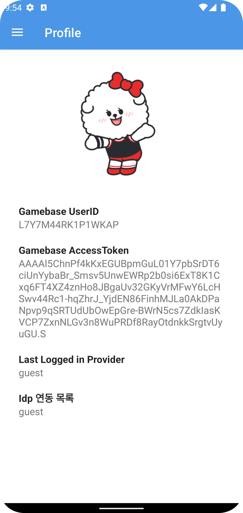
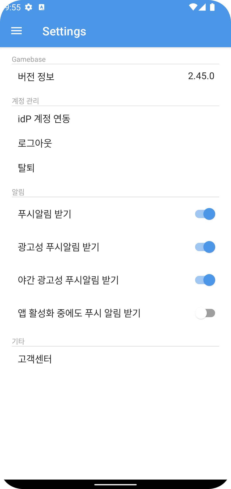
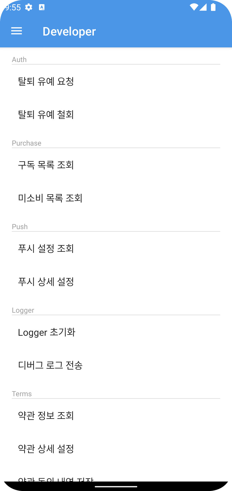

# Gamebase Sample App for Android Overview
This is a Sample App that allows you to refer to the basic flow when applying the Gamebase Android SDK. This app makes it easier to apply the Gamebase Android SDK.

    

   * [Start guide](https://docs.nhncloud.com/en/Game/Gamebase/en/aos-started)   
   * [SDK 연동 가이드](https://docs.nhncloud.com/ko/Game/Gamebase/ko/aos-started)

# Requirements
* minSdk 22

# Release Notes

   * [Release Note](https://docs.nhncloud.com/en/Game/Gamebase/en/release-notes-android)  
   * [릴리즈 노트](https://docs.nhncloud.com/ko/Game/Gamebase/ko/release-notes-android)

# Contents
| Screen                                                                                  | Description                                                                                                                                                           |
|-----------------------------------------------------------------------------------------|-----------------------------------------------------------------------------------------------------------------------------------------------------------------------|
| 
LoginScreen 
        | This is the login screen. You can select various external IdP, including Guest login.                                                                              |
| 
HomeScreen 
          | This is the main screen. You can click the menu button in the upper left corner to go to a different screen.                                                       |
| 
ShoppingScreen 
  | This is the shopping screen. You can check and purchase items set on the Gamebase console.                                                                         |
| 
ProfileScreen 
    | This is the profile screen. You can check the information of your account.                                                                                         |
| 
SettingScreen 
    | This is the setting screen. This screen manages the overall settings of the sample app, including account management, notifications and etc.                       |
| 
DeveloperScreen 
 | This is the developer screen. This screen allows you to call the Gamebase SDK API, which is not used directly in the Sample App or can be additionally configured. |

# Restrictions
This sample app is basically connected to our NHN Cloud Console. So, there are restrictions to check some features. To check all features, you must register a new project in the NHN Cloud Console(https://www.nhncloud.com) and change information at [Fix me] parts in source code.

### How to register a new project?

   * [Console Guide](https://docs.nhncloud.com/en/Game/Gamebase/en/oper-app/)
   * [콘솔 사용 가이드](https://docs.nhncloud.com/ko/Game/Gamebase/ko/oper-app/)
